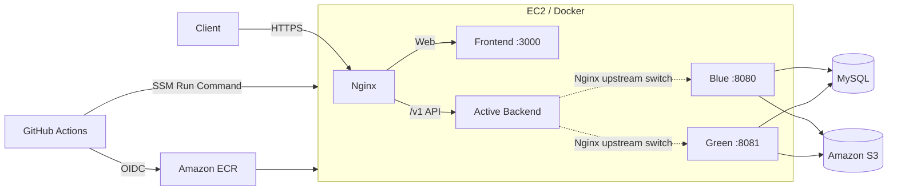
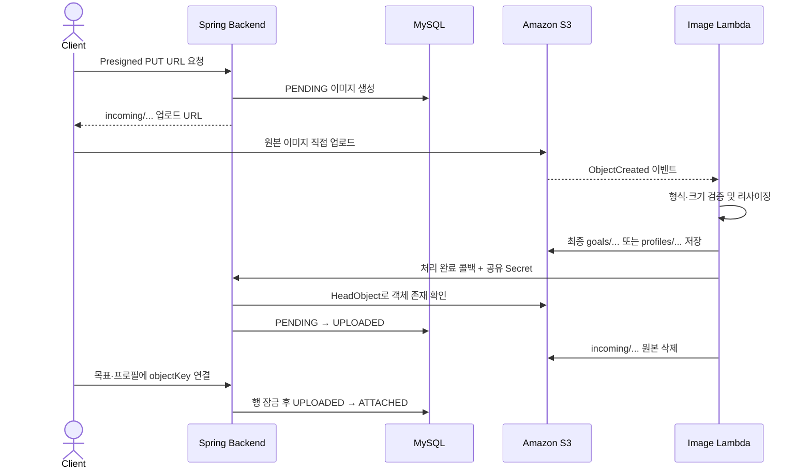
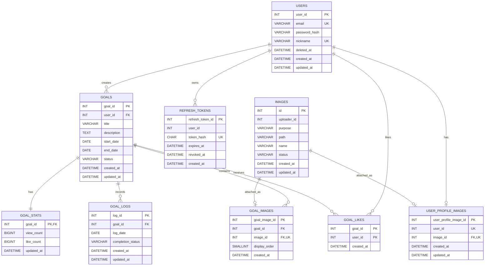

# 아무말 (AMUMAL) Backend

> 목표를 세우고, 매일의 실천을 기록하며, 다른 사람의 목표를 함께 응원하는 목표 공유 커뮤니티의 백엔드입니다.

## 목차

- [서비스 소개](#서비스-소개)
- [사용 기술](#사용-기술)
- [서비스 시연 영상](#서비스-시연-영상)
- [폴더 구조](#폴더-구조)
- [아키텍처 설계](#아키텍처-설계)
- [구현 기능](#구현-기능)
- [데이터베이스 설계](#데이터베이스-설계)
- [성능 최적화](#성능-최적화)

## 서비스 소개

**아무말(AMUMAL)** 은 사용자가 자신의 목표를 공개하고 진행 상황을 기록하며, 다른 사용자의 목표에 좋아요를 남길 수 있는 커뮤니티 서비스입니다.

백엔드는 회원과 인증, 목표, 일별 수행 기록, 좋아요와 통계, 이미지 업로드 수명 주기를 담당합니다. 이미지 파일은 애플리케이션 서버를 거치지 않고 S3에 직접 업로드하며, Lambda가 비동기로 리사이징한 뒤 백엔드가 처리 상태와 도메인 연결을 관리합니다.

- 배포 서비스: [https://kylamumal.cloud](https://kylamumal.cloud)
- API 기본 경로: `/v1`
- 응답 형식: `{ success, status, message, data }`

## 사용 기술

| 구분 | 기술 | 사용 목적 |
|---|---|---|
| Language | Java 21 | 백엔드 애플리케이션 개발 |
| Framework | Spring Boot 4.0.6, Spring MVC | REST API와 애플리케이션 구성 |
| Persistence | Spring Data JPA, Hibernate | ORM과 트랜잭션 관리 |
| Query | JPQL DTO Projection, QueryDSL 5.1 | 조회 전용 쿼리 최적화와 동적 쿼리 확장 기반 |
| Database | MySQL 8.4 | 서비스 데이터 저장 |
| Authentication | JJWT 0.12.6, BCrypt | 액세스·리프레시 토큰 인증과 비밀번호 단방향 해싱 |
| Validation | Jakarta Validation | 요청 데이터 검증 |
| Storage | AWS S3, AWS SDK for Java v2 | Presigned URL 발급과 이미지 객체 관리 |
| Image Processing | AWS Lambda, Node.js, Sharp | 이미지 검증, 회전 보정, 리사이징과 압축 |
| Monitoring | Spring Boot Actuator, Tomcat Access Log | 헬스 체크와 요청 지표 수집 |
| Test | JUnit 5, AssertJ, H2(MySQL mode), Hibernate Statistics | 도메인·쿼리·인증 필터 통합 검증 |
| Build / Deploy | Gradle 9, Docker, GitHub Actions, ECR, SSM, Nginx | 빌드, 이미지 배포와 블루–그린 전환 |

## 서비스 시연 영상

> 시연 영상 URL을 추가해 주세요.

<!-- 예시: [아무말 서비스 시연 영상](https://youtu.be/VIDEO_ID) -->

## 폴더 구조

```text
amumal_BE/
├── .github/workflows/              # 백엔드 CI/CD 워크플로
├── docs/
│   ├── image-transaction-mapping.md # 이미지 상태와 트랜잭션 설계
│   └── performance/                # 검색 성능 측정 가이드
├── lambda/image-resizer/           # S3 이벤트 기반 이미지 리사이징 Lambda
├── script/
│   ├── deploy-blue-green.sh        # 무중단 블루–그린 배포 스크립트
│   └── seed-*.sql                  # 성능 측정용 데이터 생성 스크립트
├── src/
│   ├── main/
│   │   ├── java/com/kyla/community/
│   │   │   ├── domain/
│   │   │   │   ├── auth/           # 로그인, 토큰 재발급·폐기
│   │   │   │   ├── goal/           # 목표, 기록, 좋아요와 통계
│   │   │   │   ├── image/          # 이미지 상태, S3 저장소와 고아 객체 정리
│   │   │   │   └── user/           # 회원과 프로필 이미지
│   │   │   └── global/
│   │   │       ├── common/         # 공통 API 응답
│   │   │       ├── config/         # CORS, QueryDSL, S3, 보안 설정
│   │   │       ├── entity/         # 생성·수정 시간 공통 엔티티
│   │   │       ├── exception/      # 전역 예외 처리
│   │   │       ├── filter/         # JWT 인증 필터
│   │   │       └── security/       # 토큰과 인가 유틸리티
│   │   └── resources/              # 기본·성능·진단 프로필 설정
│   └── test/                        # 도메인 및 쿼리 통합 테스트
├── Dockerfile                      # JDK 빌드 / JRE 실행 멀티 스테이지 이미지
├── docker-compose.blue.yaml        # Blue 애플리케이션(호스트 8080)
├── docker-compose.green.yaml       # Green 애플리케이션(호스트 8081)
└── build.gradle
```

애플리케이션은 기능별로 `controller → service → repository → entity`를 묶는 도메인 중심 패키지 구조를 사용합니다. 공통 응답, 인증 필터, 예외 처리처럼 여러 도메인이 공유하는 코드는 `global`에 분리했습니다.

## 아키텍처 설계

### 서비스 및 배포 아키텍처



- CI는 테스트와 JAR·Docker 이미지 빌드를 검증한 후 커밋 SHA 기반의 불변 이미지 태그를 ECR에 게시합니다.
- CD는 장기 AWS 키 대신 GitHub OIDC로 임시 권한을 얻고, SSM Run Command로 EC2에 배포 명령을 전달합니다.
- 비활성 색상의 컨테이너를 먼저 실행하고 Actuator 헬스 체크를 통과하면 Nginx upstream을 전환합니다.
- 전환 후 Nginx 경유 헬스 체크까지 성공한 경우에만 이전 컨테이너를 종료합니다.

### 이미지 처리 아키텍처



- 클라이언트가 S3로 직접 업로드하므로 큰 이미지 바이트가 WAS의 메모리와 네트워크를 점유하지 않습니다.
- 이미지 상태와 연결 테이블을 같은 DB 트랜잭션에서 변경하여 도메인 연결과 상태가 함께 커밋되거나 롤백됩니다.
- 연결되지 않은 `PENDING`, `UPLOADED`, `DELETE_FAILED` 이미지는 스케줄러가 기본 24시간 후 100개 단위로 정리합니다.

## 구현 기능

### 회원 및 인증

- 이메일·닉네임 중복 확인과 회원가입
- BCrypt를 이용한 비밀번호 단방향 해싱
- 액세스 토큰과 리프레시 토큰 발급
- DB에는 리프레시 토큰 원문 대신 SHA-256 해시 저장
- 리프레시 토큰을 이용한 액세스 토큰 재발급
- 로그아웃 시 리프레시 토큰 폐기
- JWT 필터를 통한 공개·보호 API 분리
- 본인만 프로필·비밀번호를 변경하거나 계정을 탈퇴할 수 있도록 인가 검증
- 회원 탈퇴 시 `deleted_at`을 기록하는 소프트 삭제

### 목표

- 목표 생성, 목록·상세 조회, 수정과 삭제
- `IN_PROGRESS`, `COMPLETED`, `PAUSED`, `CANCELLED` 상태 관리
- 시작일·종료일 유효성 검증
- 생성 시 목표 통계 행을 함께 생성
- 목표 수정·삭제 시 비관적 쓰기 잠금으로 동시 변경 충돌 방지
- 생성 시각과 목표 ID를 조합한 불투명 커서 기반 페이지네이션
- 제목·설명을 대상으로 한 키워드 검색

### 수행 기록

- 목표별 일간 수행 상태 조회
- 날짜별 `COMPLETED`, `FAILED`, `SKIPPED` 기록 생성·수정과 삭제
- `(goal_id, log_date)` 유니크 제약으로 같은 날짜에 하나의 기록만 유지
- 목표 작성자만 기록을 변경할 수 있도록 소유권 검증

### 좋아요와 통계

- 좋아요 상태 조회, 등록과 취소
- `(goal_id, user_id)` 복합 기본 키와 `INSERT IGNORE`를 이용한 중복 요청의 멱등 처리
- 좋아요 행이 실제로 생성·삭제된 경우에만 집계 값 변경
- 조회 수와 좋아요 수를 엔티티 조회 후 변경하지 않고 단일 `UPDATE` 쿼리로 원자적 증가·감소
- 좋아요 수 감소 시 0 미만으로 내려가지 않도록 조건식 적용

### 이미지

- 목표·프로필 이미지용 S3 Presigned PUT URL 발급
- JPEG·PNG 형식, 확장자와 최대 파일 크기 검증
- Lambda에서 EXIF 회전 보정, 최대 해상도 제한, 리사이징과 압축
- 목표 이미지 순서 검증 및 `display_order = 0`을 대표 이미지로 사용
- Lambda 콜백 Secret을 상수 시간 비교하고 S3 객체 존재 여부 확인
- 행 잠금과 상태 전이로 다른 사용자의 이미지 연결 및 중복 연결 방지
- 업로드 실패·사용자 취소·트랜잭션 롤백으로 남은 고아 객체 재시도 정리

## 데이터베이스 설계

### ERD



### 주요 설계 결정

| 설계 | 이유 |
|---|---|
| `goals`와 `goal_stats`를 1:1 분리 | 자주 갱신되는 조회·좋아요 수와 목표 본문을 분리하고 원자적 카운터 갱신 적용 |
| `goal_stats.goal_id`에 `@MapsId` 적용 | 목표와 통계가 같은 식별자를 공유하도록 하여 불필요한 대리 키 제거 |
| 좋아요에 `(goal_id, user_id)` 복합 PK 적용 | 한 사용자가 같은 목표에 중복 좋아요를 남길 수 없도록 DB 수준에서 보장 |
| 기록에 `(goal_id, log_date)` 유니크 제약 적용 | 목표별 하루 하나의 수행 기록 보장 |
| 이미지 메타데이터와 연결 테이블 분리 | 업로드 상태 수명 주기와 목표·프로필 연결의 책임 분리 |
| `goal_images(image_id)`와 `user_profile_images(image_id)` 유니크 | 각 연결 테이블 안에서 이미지 재사용을 막고, 이미지 상태 전이로 도메인 간 중복 연결 방지 |
| `goal_images(goal_id, display_order)` 유니크 | 목표 안에서 이미지 순서 중복 방지 |
| `images(path, name)` 유니크 | S3 최종 Object Key 중복 방지 |
| 소프트 삭제된 회원 보존 | 작성한 콘텐츠와 참조 무결성을 유지하면서 로그인은 차단 |

### 주요 인덱스

| 테이블 | 인덱스·제약 | 활용 쿼리 |
|---|---|---|
| `goals` | `(created_at DESC, goal_id DESC)` | 최신순 목록과 커서 다음 페이지 조회 |
| `images` | `(status, created_at)` | 보존 기간이 지난 고아 이미지 후보 탐색 |
| `users` | `UNIQUE(email)`, `UNIQUE(nickname)` | 중복 검사와 로그인 |
| `refresh_tokens` | `UNIQUE(token_hash)` | 리프레시 토큰 검증 |
| `goal_likes` | `PRIMARY KEY(goal_id, user_id)` | 좋아요 존재 여부와 멱등 등록 |
| `goal_logs` | `UNIQUE(goal_id, log_date)` | 목표·날짜별 기록 조회와 upsert 동작 |

## 성능 최적화

### N+1 조회 최적화

#### 문제

기존 목록 조회는 먼저 목표 목록을 조회한 뒤, 각 목표를 응답 DTO로 변환하면서 통계, 작성자, 작성자 프로필 이미지와 목표 이미지를 개별 조회했습니다.

목록 크기를 `N`, 서로 다른 작성자 수를 `U`라고 하면 쿼리 수는 다음과 같았습니다.

```text
목표 목록 1회
+ 목표 통계 N회
+ 목표 이미지 N회
+ 작성자 프로필 이미지 N회
+ 작성자 조회 U회
= 1 + 3N + U회 (최악의 경우 1 + 4N회)
```

한 페이지에 서로 다른 작성자의 목표 20개가 노출되면 최악의 경우 **81회**의 쿼리가 실행될 수 있었습니다.

#### 개선

목록 화면에 필요한 값만 세 종류의 조회로 나누어 일괄 로딩했습니다.

1. 목표, 작성자, 통계를 조인한 `GoalListRowDto` 프로젝션 조회 1회
2. 현재 페이지의 `goal_id IN (...)` 조건으로 `display_order = 0` 대표 이미지 조회 1회
3. 현재 페이지 작성자의 `user_id IN (...)` 조건으로 프로필 이미지 조회 1회

조회 결과는 `Map<goalId, image>`와 `Map<userId, profile>`로 변환한 후 메모리에서 응답 DTO에 조립합니다. 컬렉션 fetch join으로 페이지네이션이 왜곡되거나 행이 중복되는 문제도 피했습니다.

| 항목 | 개선 전 | 개선 후 |
|---|---:|---:|
| 쿼리 수 | `1 + 3N + U` | 항상 `3` |
| 20개·작성자 20명 기준 | 최대 81회 | 3회 |
| 조회 형태 | 엔티티 조회 후 연관 데이터 반복 조회 | DTO Projection + `IN` 일괄 조회 |
| 영속성 컨텍스트 | 화면에 불필요한 엔티티까지 관리 | 필요한 컬럼만 조회 |

`GoalListQueryIntegrationTest`에서 일반 목록과 검색 목록 모두 Hibernate Statistics의 `prepareStatementCount`가 정확히 **3회**인지 검증하여 회귀를 방지합니다.

상세 조회에서는 단일 연관인 `GoalStat`만 fetch join하고, 여러 건이 될 수 있는 이미지는 정렬된 DTO 프로젝션 쿼리로 분리했습니다. 이 방식은 여러 컬렉션 조인으로 발생할 수 있는 카테시안 곱을 피하면서 이미지 순서를 보장합니다.

### 페이지네이션 및 정렬 쿼리 최적화

- offset이 커질수록 앞선 행을 읽고 버려야 하는 offset 페이지네이션 대신 `(created_at, goal_id)` 기반 keyset pagination을 적용했습니다.
- 생성 시각이 같은 목표도 중복·누락 없이 탐색할 수 있도록 `goal_id`를 tie-breaker로 사용합니다.
- 커서에는 버전, 마지막 `created_at`, `goal_id`를 URL-safe Base64로 인코딩하여 내부 정렬 키를 직접 노출하지 않습니다.
- `limit + 1`개만 조회하여 다음 페이지 존재 여부를 판단하므로 별도의 `COUNT(*)` 쿼리가 필요하지 않습니다.
- 조회 조건과 정렬 순서에 맞춰 `goals(created_at DESC, goal_id DESC)` 복합 인덱스를 구성했습니다.

```sql
WHERE created_at < :cursorCreatedAt
   OR (created_at = :cursorCreatedAt AND goal_id < :cursorGoalId)
ORDER BY created_at DESC, goal_id DESC
LIMIT :limitPlusOne;
```

### 쓰기 쿼리 및 동시성 최적화

- 조회 수와 좋아요 수는 값을 읽고 수정하는 read-modify-write 방식 대신 `count = count + 1` 단일 UPDATE로 변경했습니다.
- 좋아요 등록은 복합 PK와 MySQL `INSERT IGNORE`를 사용하며, 실제 삽입 성공 건수가 1일 때만 집계를 증가시킵니다.
- 좋아요 취소도 실제 삭제 성공 건수가 1일 때만 집계를 감소시켜 재시도 요청을 멱등하게 처리합니다.
- 목표 수정·삭제와 이미지 상태 전이에는 `PESSIMISTIC_WRITE` 잠금을 적용하여 동시에 들어온 요청이 상태를 덮어쓰지 않도록 했습니다.
- 고아 이미지 후보는 한 번에 100개만 조회해 긴 트랜잭션과 대량 잠금을 피하고, S3 삭제는 DB 트랜잭션 밖에서 수행합니다.

### 측정과 진단

- `perf` 프로필: SQL 로그를 끄고 HikariCP 조건을 고정하며 HTTP p50·p95·p99 지표와 access log를 수집합니다.
- `diagnostic` 프로필: Hibernate SQL과 slow query 로그를 활성화하여 원인을 분석합니다.
- MySQL `EXPLAIN ANALYZE`와 Performance Schema로 실행 시간, 스캔 행 수, 정렬·임시 테이블 사용 여부를 확인할 수 있습니다.

### 현재 검색 쿼리의 한계와 개선 방향

현재 검색은 제목과 설명에 `LOWER(column) LIKE '%keyword%'` 조건을 사용합니다. 앞쪽 와일드카드와 함수 적용 때문에 일반 B-Tree 인덱스의 효율을 기대하기 어렵습니다.

데이터 증가 시에는 동일한 데이터셋과 부하 조건에서 다음 대안을 비교한 뒤 도입할 계획입니다.

- MySQL `FULLTEXT` 인덱스와 ngram parser
- 검색 전용 컬럼 또는 정규화 전략
- 검색 요구가 복잡해질 경우 Elasticsearch/OpenSearch와 같은 별도 검색 엔진

검색 방식은 정확도와 한글 토큰화 결과까지 함께 검증해야 하므로, 목록용 복합 인덱스의 효과와 검색 성능 개선을 구분해 측정합니다.
